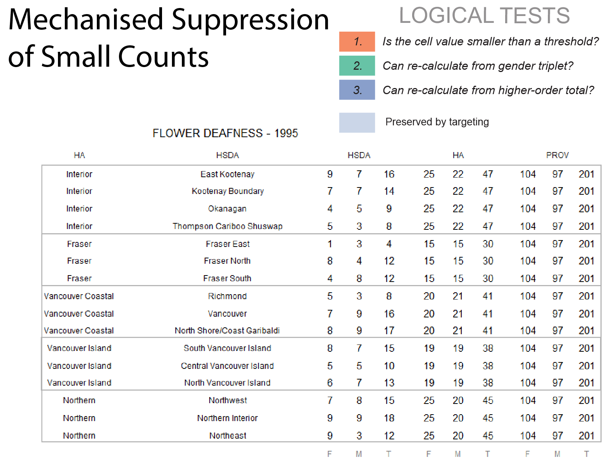
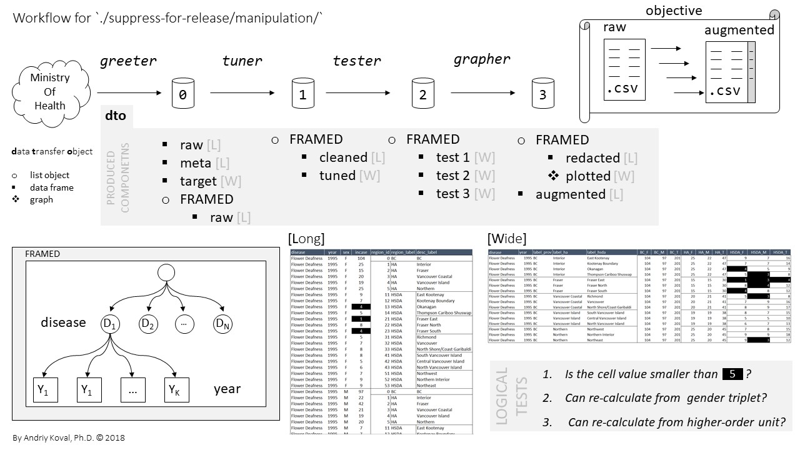
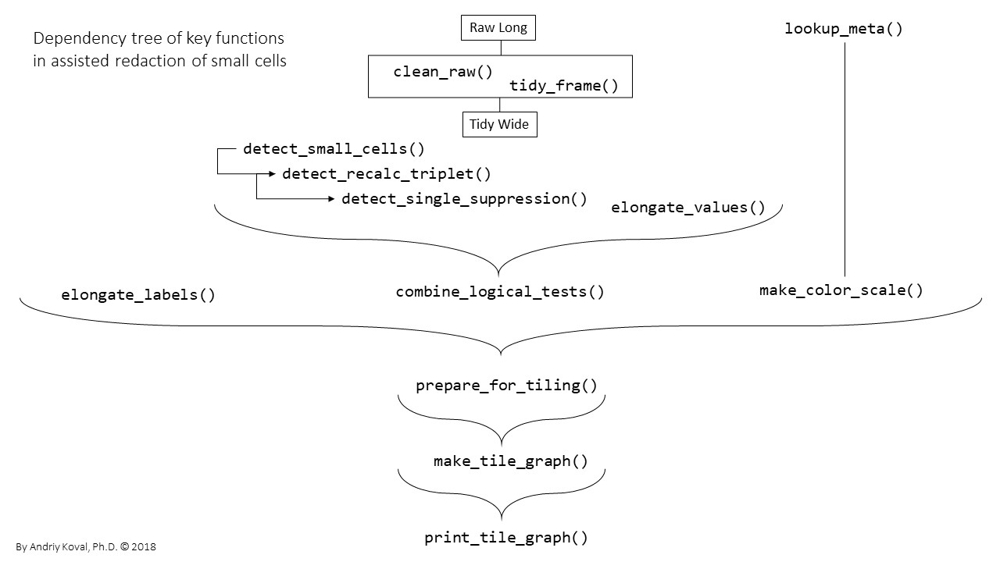

-  slides for [USING REPRODUCIBLE DATA VISUALIZATIONS TO AUGMENT DECISION-MAKING DURING SUPPRESSION OF SMALL COUNTS](https://raw.githack.com/IHACRU/suppress-for-release/master/libs/materials/koval-2020-suppress-for-release.pdf) - talk at the 2020 Conference of the International Population Data Linkkage Network, Adelaide, Australia (virtual) 

# suppress-for-release

Demonstrates the methods of suppressing small counts in a provincial surveillance system in preparation of data for public release.

# Background

When a surveillance agency intends to release incidence counts of some health conditions (like in [BC Chronic Disease Dashboard][dashboard]), one must take precaution NOT to disclose values considered "too small", which may present a privacy/re-identification risk. Howeever, redacted values sometimes can be re-calculated from the context, so an analyst must detect these patterns and redact more values in order to remove the possiblity of re-calculation. To avoid manual redaction, which is prone to human error and lacks transparency, [BC Observatory][observatory] has developed a suite of R functions to arrive at recommendation for redaction automatically, based on logical tests developed for standard data forms.

For detailed background of the problem this project addresses, please view the slides from the Community of Practice [presentation][cop-presentation] at BCCDC on 2018-03-07 by Brent and Andriy. For the update on the suppression logic (vesion 2) please see [slides][logic-update] by Anthony Leamon. 

# Workflow

The following scripts comprise the workflow of the mechanized redaction of small cells:

- [`./manipulation/0-greeter.R`][greeter] - imports data, establishes decison frame
- [`./manipulation/1-tuner.R`][tuner] - cleans and transformes data
- [`./manipulation/2-tester.R`][tester] - applies logical tests to each frame
- [`./manipulation/3-grapher.R`][grapher] - redacts and plots decisions

 
[][workflow]

# Key functions

[][dependency_tree]


# Team & Funders
- [Anothoy Leamon](mailto:Anthony.Leamon@viha.ca ), Regional Epidemiologist, Island Health, [BC OPPH][observatory]
- [Sylvia ElKurdi](mailto:Sylvia.ElKurdi@bccdc.ca), Regional Epidemiologist, [Observatory for Population & Public Health][observatory] of British Columbia (BCOPPH)
-  [Brent Harris](mailto:Brent.andrew.harris@gmail.com), Regional Epidemiologist with Interior Health Authority of British Columbia, [BCPOPPH][observatory] 
-  [Andriy Koval](mailto:koval.andrey@gmail.com), [Health System Impact Fellow (2017)][hsif], [Observatory for Population & Public Health][observatory] of British Columbia (BCOPPH)


The automated small cell suppression for public release project is part of the work flow for annual updates and public release of the [ Chronic Disease Dashboard][dashboard] developed by the  [BC Observatory for Population & Public Health][observatory] based on data provided by the BC Ministry of Health, Provincial Health Officer's Office. 


# Reproduction
If you wish to follow along, please install the latest version of [RStudio][Rstudio], clone/download this repository and makes sure the 
following script can execute without errors:

```r
library(ggplot2)   
library(magrittr)  
library(dplyr)     
library(readr)     
library(testit)    
library(tidyr)     
library(rmarkdown) 
```

[Rstudio]:https://www.rstudio.com/products/rstudio/download/

[hsif]:http://www.cihr-irsc.gc.ca/e/50268.html
[observatory]:http://www.bccdc.ca/our-services/programs/bc-observatory-for-pop-public-health
[bccdc]:http://www.bccdc.ca/
[cihr]:http://www.cihr-irsc.gc.ca/

[cop-presentation]:https://raw.githack.com/IHACRU/suppress-for-release/master/libs/materials/community-of-practice-2018-03-07.pdf
[logic-update]:https://raw.githack.com/IHACRU/suppress-for-release/master/libs/materials/data-suppression-logic-update-TL-2018-10-20.pdf

[greeter]:https://github.com/IHACRU/suppress-for-release/blob/master/manipulation/0-greeter.R
[tuner]:https://github.com/IHACRU/suppress-for-release/blob/master/manipulation/1-tuner.R
[tester]:https://github.com/IHACRU/suppress-for-release/blob/master/manipulation/2-tester.R
[grapher]:https://github.com/IHACRU/suppress-for-release/blob/master/manipulation/3-grapher.R

[workflow]:https://raw.githubusercontent.com/IHACRU/suppress-for-release/master/libs/materials/suppress-for-release-image-support/Slide2.JPG

[dependency_tree]:https://raw.githubusercontent.com/IHACRU/suppress-for-release/master/libs/materials/suppress-for-release-image-support/Slide3.JPG

[observatory]:http://www.bccdc.ca/our-services/programs/bc-observatory-for-pop-public-health

[dashboard]:http://www.bccdc.ca/health-info/disease-system-statistics/chronic-disease-dashboard
